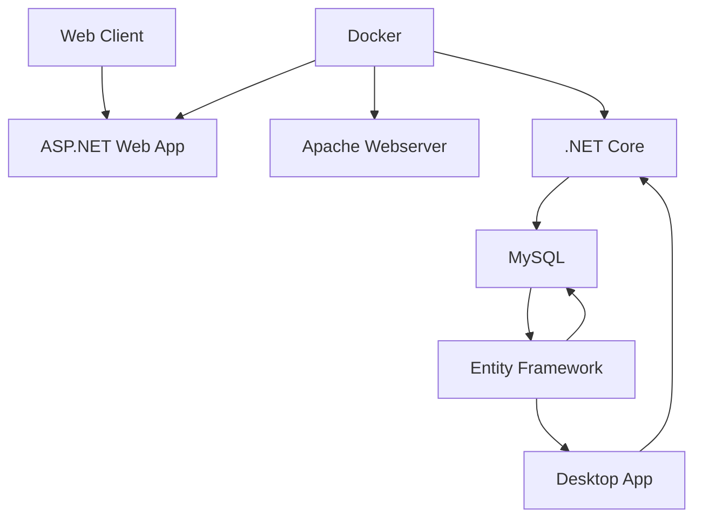

# Mitarbeiterverzeichnis

Mitarbeiterverzeichnis (MVZ) is a locally hosted alternative to paid digital collaboration systems like Arbeitnehmer Online by DATEV for managing personal documents such as payroll reports.

<!-- PROJECT SHIELDS -->
<!--
*** I'm using markdown "reference style" links for readability.
*** Reference links are enclosed in brackets [ ] instead of parentheses ( ).
*** See the bottom of this document for the declaration of the reference variables
*** for contributors-url, forks-url, etc. This is an optional, concise syntax you may use.
*** https://www.markdownguide.org/basic-syntax/#reference-style-links
-->

<!-- ABOUT THE PROJECT -->
## About The Project

### Architecture 

(<a href="#readme-top">back to top</a>)

### Built With

(<a href="#readme-top">back to top</a>)

<!-- GETTING STARTED -->
## Getting Started

### Installation

## Usage

TODO: Update usage instructions

### Prerequisites

Install [Docker](https://docs.docker.com/get-docker/) and [Docker Compose](https://docs.docker.com/compose/install/) on your local machine.

### Installation

    

    
1.  Clone the repository:

``git clone https://github.com/yourusername/Mitarbeiterverzeichnis``

2. Navigate to the project directory and build the Docker images:

``cd Mitarbeiterverzeichnis``
``docker-compose build``

<!-- USAGE EXAMPLES -->
## Usage

Use this space to show useful examples of how a project can be used. Additional screenshots, code examples and demos work well in this space. You may also link to more resources.

(<a href="#readme-top">back to top</a>)

<!-- ROADMAP -->
## Roadmap

<!-- CONTRIBUTING -->
## Contributing

Contributions are what make the open source community such an amazing place to learn, inspire, and create. Any contributions you make are **greatly appreciated**.

If you have a suggestion that would make this better, please fork the repo and create a pull request. You can also simply open an issue with the tag "enhancement".
Don't forget to give the project a star! Thanks again!

1. Fork the Project
2. Create your Feature Branch (`git checkout -b feature/AmazingFeature`)
3. Commit your Changes (`git commit -m 'Add some AmazingFeature'`)
4. Push to the Branch (`git push origin feature/AmazingFeature`)
5. Open a Pull Request

(<a href="#readme-top">back to top</a>)

<!-- LICENSE -->
## License

Distributed under the MIT License. See `LICENSE.txt` for more information.

(<a href="#readme-top">back to top</a>)

<!-- CONTACT -->
## Contact

<!-- ACKNOWLEDGMENTS -->
## Acknowledgments
